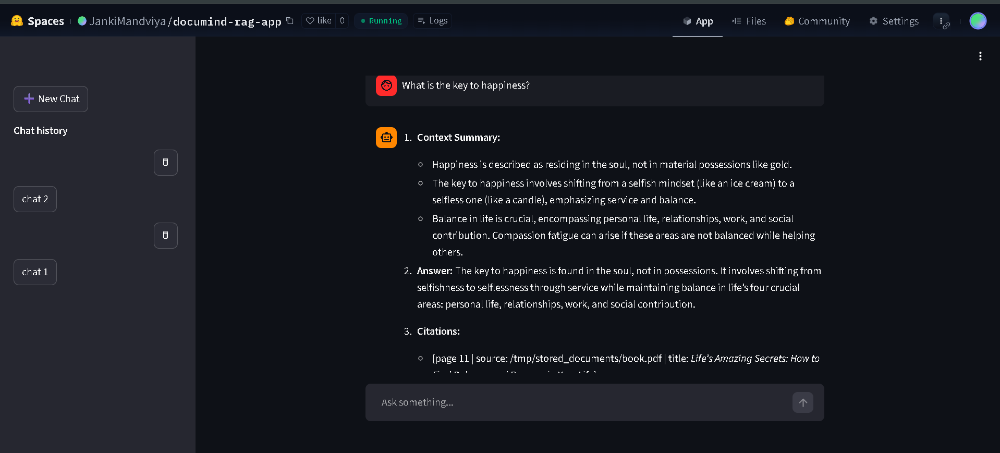

# 📄 DocuMind — Enterprise Document RAG Assistant

DocuMind is an **Enterprise Document Question Answering System** built using **Retrieval Augmented Generation (RAG)**.
It allows users to upload documents and ask natural language questions, while the system retrieves relevant context and generates accurate answers using a Large Language Model.

The application is designed with **production-ready architecture**, supporting **multiple sessions, document storage, and scalable deployment using Docker**.

---

# 🚀 Features

### 📂 Document Intelligence

* Upload and process enterprise documents
* Automatic document chunking
* Semantic embedding generation
* Vector similarity search using FAISS

### 🔍 Retrieval Augmented Generation (RAG)

* Context-aware answer generation
* Semantic search over document chunks
* Prompt engineering for grounded responses

### 💬 Interactive Chat Interface

* Built using **Streamlit**
* Multi-session interaction
* Persistent message history

### ⚡ Efficient Retrieval

* FAISS vector database
* Fast nearest neighbor search
* Optimized chunk retrieval

### 🤖 LLM Integration

* Uses **Mistral API (Mistral-7B Instruct)** for response generation
* Context grounding to prevent hallucination

### 📦 Production Ready

* Containerized using **Docker**
* Deployable on **HuggingFace Spaces**
* Secure environment variable management

---

# 🏗️ System Architecture

User Query
↓
Document Retrieval (FAISS)
↓
Relevant Context Extraction
↓
Prompt Construction
↓
LLM Response Generation (Mistral API)
↓
Final Answer

---

# 🧠 Tech Stack

| Component       | Technology              |
| --------------- | ----------------------- |
| Frontend        | Streamlit               |
| Backend         | Python                  |
| LLM Framework   | LangChain               |
| Vector Database | FAISS                   |
| Embeddings      | Sentence Transformers - e5-base-v2  |
| Prompt Orchestration  & chat history           | Langchain |
| LLM             | Mistral-7B Instruct API |
| Deployment      | Docker                  |
| Hosting         | HuggingFace Spaces      |
| Evaluation         | RAGAS (LLM as a judge : mistral-small-latest)     |
---

# ⚙️ Installation (Local Setup)

Follow the steps below to set up the project locally.

### 1️⃣ Clone the Repository

```bash
git clone https://github.com/JankiMandviya/Enterprise_document_RAG_assistant.git
cd Enterprise_document_RAG_assistant
```

---

### 2️⃣ Check Python Version

This project requires **Python 3.11.9**.

Check available Python versions:

```bash
py -0
```

If Python **3.11** is listed, you can proceed.
Otherwise install Python 3.11 before continuing.

---

### 3️⃣ Create a Virtual Environment

```bash
py -3.11 -m venv RAG_venv
```

---

### 4️⃣ Activate the Virtual Environment

```bash
source RAG_venv/Scripts/activate
```

After activation, your terminal should display:

```
(RAG_venv)
```

---

### 5️⃣ Verify Python Version

```bash
python --version
```

Expected output:

```
Python 3.11.x
```

---

### 6️⃣ Install Project Dependencies

```bash
pip install -r requirements.txt
```

---

## 🔑 Mistral API Setup

This project uses the official **Mistral AI API** to generate responses from the **Mistral 7B Instruct model**.

Using the API reduces **local RAM usage** and provides **low latency inference**.

### Step 1 — Get a Free API Key

1. Visit the Mistral AI console:

```
https://console.mistral.ai/
```

2. Create an account.

3. Generate a **new API key**.

---

### Step 2 — Create `.env` File

Create a `.env` file in the **project root directory** and add your API key:

```
Mistral_API=your_api_key_here
```

---

## ▶️ Run the Application

Start the Streamlit application:

```bash
streamlit run src/app.py
```

Open the app in your browser:

```
http://localhost:8501
```


---

# 🐳 Docker Deployment

### Build Docker Image

```bash
docker build -t documind-rag-app .
```

### Run Container

```bash
docker run -p 8501:7860 documind-rag-app
```

Open:

```
http://localhost:8501
```

---

# ☁️ HuggingFace Spaces Deployment

This project is deployed using **Docker on HuggingFace Spaces**.

Steps:

1. Create a huggingface space with Docker SDK
2. clone repository
3. Add project files to this repository with README.md with following configuration:

README.md
``` 
---
title: DocuMind - RAG Assistant
emoji: 🤖
colorFrom: blue
colorTo: green
sdk: docker
app_port: 7860
pinned: false
---
# DocuMind - Enterprise_document_RAG_assistant
An Enterprise Document RAG Assistant built with:

- Streamlit
- FAISS
- SQLite - ORM
- Mistral API
- Docker
- Langchain
- RAG

Deployment platform:
- Huggingface spaces

Features:
- Supports multiple pdfs in single session.
- Supports multiple sessions
- Retrieval Augmented Generation (RAG)
- Document upload and indexing
- Gives accurate response using context retrieved from document for given query with minimal latency.

Github Repo for Code:
https://github.com/JankiMandviya/Enterprise_document_RAG_assistant

```
3. Add secret environment variable in selected hugging face space.

```
Mistral_API = your_api_key
```
4. Push changes
```
git add .
git commit -m "your commit message"
git push
```
The container automatically builds and runs the Streamlit app.

---

# 📊 Workflow

1️⃣ Upload document

2️⃣ System splits document into chunks

3️⃣ Embeddings generated for each chunk

4️⃣ User asks question

5️⃣ Rewrite query using user query and chat history

6️⃣ FAISS retrieves relevant context

7️⃣ Prompt constructed with retrieved context and appropriate prompt mode(strict/Relaxed) for hallucination proof responses

8️⃣ Mistral LLM generates answer

# Output


# Evaluation results:
### Retrieval
| Matric                       | Result              |
| -----------------------------|---------------------|
| Hit@3                        | 0.9038              |
| Precision@3                  | 0.5769              | 
| Recall@3                     | 0.9038              |
| F1@3                         | 0.7531              |
| MRR (Mean Reciprocal Rank)   | 0.8205              | 
| nDCG@3                       | 0.8319              |
| MAP (Mean Average Precision) | 0.67                |

### Generation
| Matric              | Result              |
| --------------------|---------------------|
| Faithfulness        | 0.96                |
| Answer Relevancy    | 0.89                | 
| Context Precision   | 0.83                |
| Context Recall      | 0.82                |

# Demo Video:
https://youtu.be/3yeC--JF3lI

# 📜 License

This project is released under the MIT License.
